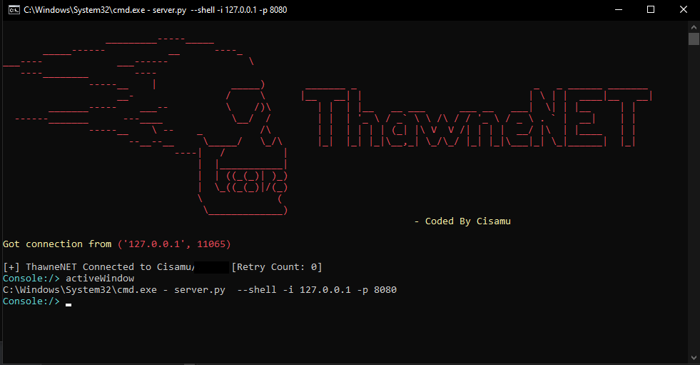
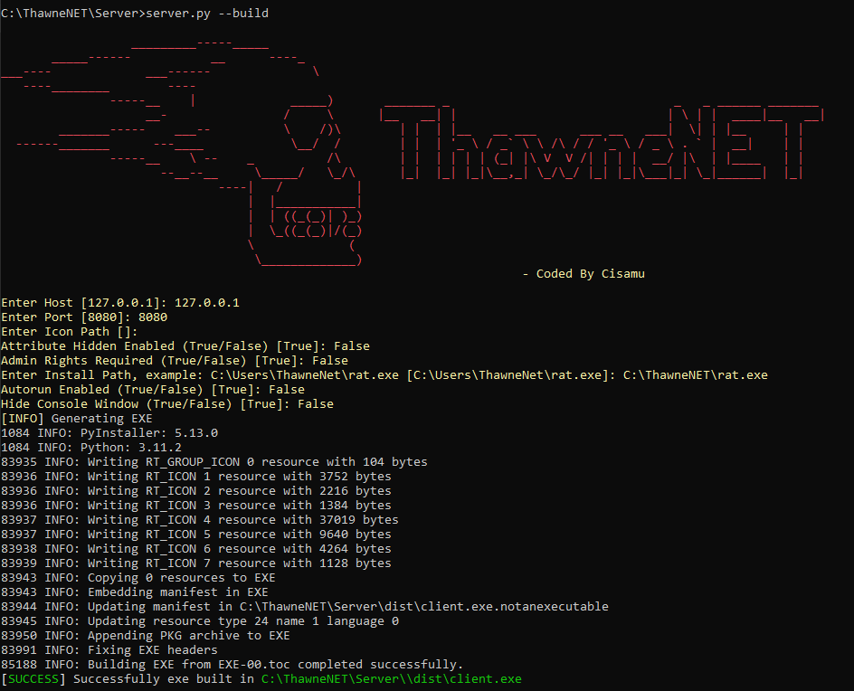

# ThawneNET 
# I apologize for the fact that RAT has little functionality because I wanted to expand it gradually, so updates will be very frequent, if you are planning to use this RAT, check for updates more often
### LEGAL DISCLAIMER PLEASE READ!
##### I, the creator and all those associated with the development and production of this program are not responsible for any actions and or damages caused by this software. You bear the full responsibility of your actions and acknowledge that this software was created for educational purposes only. This software's intended purpose is NOT to be used maliciously, or on any system that you do not have own or have explicit permission to operate and use this program on. By using this software, you automatically agree to the above.

[](https://opensource.org/licenses/MIT) 
[](https://github.com/cisamu123)
  <a href="https://t.me/CodQu">
    
  </a>
    <a href="https://t.me/Cisamu">
    
  </a>

ThawneNET is a tool designed to give the control of the windows system remotely and retrieve informations from it. ThawneNET is a client/server application developed in Python Windows for the client side and the Server is also in Python.

## Screenshots



## Prerequisites
ThawneNET requires Python3

## Installation
```
git clone https://github.com/cisamu123/ThawneNet.git
cd ThawneNET
pip install -r requirements.txt
```.

### Available Modes
* `--build` - for building the exe
* `--shell` - getting an interactive shell of the device
```
### `build` mode
Usage:
  python3 server.py --build

### `shell` mode
Usage:
  python3 server.py --shell [flags]
  Flags:
    -i, --ip                Listner IP address
    -p, --port              Listner port number
    
After running the `shell` mode you will get an interpreter of the device  

Commands which can run on the interpreter
```
    info                       --> returns basic info of the device
    activeWindow               --> returns active window
    battery                    --> returns battery info
    whois                      --> returns the ip, city, country etc of the device
    clear                      --> clears the screen
    exit                       --> exit the interpreter
```

## Examples

* To build the exe using desired ip and port:
```python3 server.py --build```

* To get the interpreter:
```python3 server.py --shell -i 0.0.0.0 -p 8000```

## Interpreter Examples
* Generating EXE
<p align="center">
  
</p>

## TODO
* Linux, MacOS (Darwin) Support
* Set up multi client
* Fix Bugs
* Maybe GUI version


## License
ThawneNET is licensed under MIT license take a look at the [LICENSE](LICENSE) for more information.

